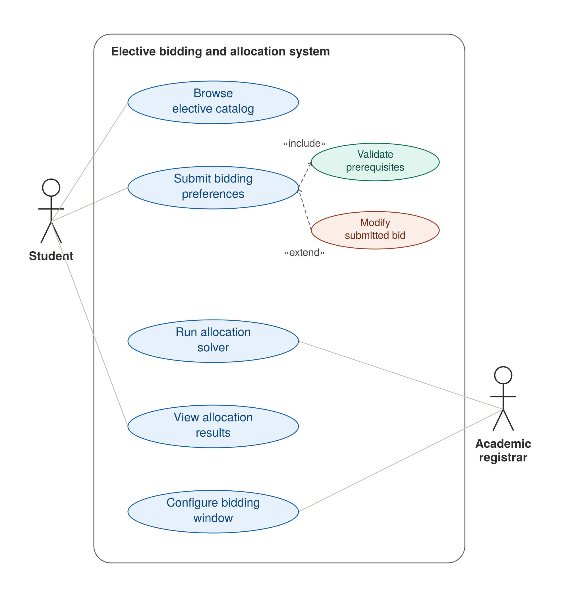

# UML Use-Case Diagram
## Academic Elective Bidding & Allocation System

**Problem Statement #05 | Campus & Academic Operations**

---

## Diagram

---

## Actors

| Actor | Description |
|-------|-------------|
| **Student** | Browses the elective catalog, submits ranked bidding preferences with credits, and views final allocation outcomes. |
| **Academic Registrar** | Configures the bidding window, runs the allocation solver, and views allocation results. |

---

## Primary Use Cases

| Use Case | Actor | Description |
|----------|-------|-------------|
| **Browse Elective Catalog** | Student | View available elective courses, schedules, prerequisites, and seat capacities before bidding. |
| **Submit Bidding Preferences** | Student | Rank elective preferences and distribute 100 bidding credits across them during the open bidding window. |
| **View Allocation Results** | Student, Academic Registrar | Review final seat assignments, unallocated preferences, and refunded credits after the allocation run. |
| **Configure Bidding Window** | Academic Registrar | Set the start and end dates/times for the elective bidding period. |
| **Run Allocation Solver** | Academic Registrar | Trigger batch seat assignment based on bid credits, course capacity, and prerequisite eligibility. |

---

## Supporting Use Cases

| Use Case | Role in Diagram | Description |
|----------|-----------------|-------------|
| **Validate Prerequisites** | Included by Submit Bidding Preferences | Checks that the student has completed required prerequisite courses for each selected elective. |
| **Modify Submitted Bid** | Extends Submit Bidding Preferences | Allows a student to revise ranked preferences or credit allocations on an already submitted bid while the window is open. |

---

## Relationships

### «include» (mandatory sub-behaviour)

| Base Use Case | Included Use Case | Rationale |
|---------------|-------------------|-----------|
| Submit Bidding Preferences | Validate Prerequisites | Prerequisite checking is always performed when preferences are submitted; ineligible courses cannot be saved (FR-002). |

### «extend» (optional / conditional behaviour)

| Extending Use Case | Base Use Case | Condition |
|--------------------|---------------|-----------|
| Modify Submitted Bid | Submit Bidding Preferences | Triggered when a student chooses to change an existing bid submission before the bidding window closes. |

---

## Traceability to Requirements

| Use Case | Related Requirements |
|----------|-------------------|
| Browse Elective Catalog | FR-001 |
| Submit Bidding Preferences | FR-001, FR-002 |
| Validate Prerequisites | FR-002 |
| Modify Submitted Bid | FR-001 |
| Configure Bidding Window | FR-004 |
| Run Allocation Solver | FR-004, NFR-001 |
| View Allocation Results | FR-005 |

---

## Diagram Accuracy Notes

| Check | Status | Notes |
|-------|--------|-------|
| All actors modelled | ✓ | Student and Academic Registrar match the problem statement. |
| Primary use cases present | ✓ | Covers catalog browsing, bidding, allocation, and registrar operations. |
| At least one «include» | ✓ | Submit Bidding Preferences → Validate Prerequisites. |
| At least one «extend» | ✓ | Modify Submitted Bid → Submit Bidding Preferences. |
| FR-003 (timetable conflict warning) | ⚠ Gap | No use case models timetable-collision detection/warning before submission. Consider adding **Acknowledge Timetable Conflict Warning** as a «extend» on Submit Bidding Preferences. |
| FR-004 (course capacity config) | ⚠ Partial | **Configure Bidding Window** covers the window only; course seat capacities are not shown as a separate use case. |
