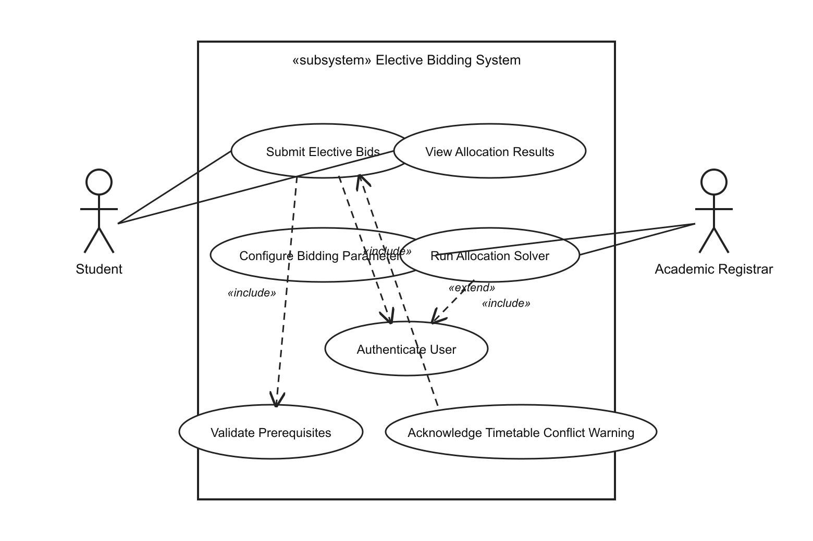

# UML Use-Case Diagram
## Academic Elective Bidding & Allocation System

**Problem Statement #05 | Campus & Academic Operations**

---

## Diagram

---

## Actors

| Actor | Description |
|-------|-------------|
| **Student** | Enrolls in electives by submitting ranked bids with bidding credits and viewing final allocation outcomes. |
| **Academic Registrar** | Configures the bidding window and course capacities, then executes the allocation solver to assign seats. |

---

## Primary Use Cases

| Use Case | Actor | Description |
|----------|-------|-------------|
| **Submit Elective Bids** | Student | Rank up to 10 elective preferences and distribute 100 bidding credits across them during the open bidding window. |
| **View Allocation Results** | Student | Review assigned electives, unallocated preferences, and refunded credits after the allocation run completes. |
| **Configure Bidding Parameters** | Academic Registrar | Set the bidding window dates, course seat capacities, and elective catalog for the current semester. |
| **Run Allocation Solver** | Academic Registrar | Trigger batch seat assignment based on bid credits, course capacity, prerequisites, and timetable constraints. |

---

## Relationships

### «include» (mandatory sub-behaviour)

| Base Use Case | Included Use Case | Rationale |
|---------------|-------------------|-----------|
| Submit Elective Bids | Authenticate User | Every bid submission must verify the student's identity via university SSO before any data is accepted. |
| Submit Elective Bids | Validate Prerequisites | Prerequisite checking is always performed as part of bid submission; a bid cannot be saved without it (FR-002). |
| Run Allocation Solver | Authenticate User | Only an authenticated registrar may trigger the allocation engine. |

### «extend» (optional / conditional behaviour)

| Extending Use Case | Base Use Case | Condition |
|--------------------|---------------|-----------|
| Acknowledge Timetable Conflict Warning | Submit Elective Bids | Triggered only when the student's selected electives have overlapping time slots; the student must acknowledge the warning or revise preferences before proceeding (FR-003). |

---

## Traceability to Requirements

| Use Case | Related Requirements |
|----------|-------------------|
| Submit Elective Bids | FR-001, FR-002, FR-003 |
| Validate Prerequisites | FR-002 |
| Acknowledge Timetable Conflict Warning | FR-003 |
| Configure Bidding Parameters | FR-004 |
| Run Allocation Solver | FR-004, NFR-001 |
| View Allocation Results | FR-005 |
| Authenticate User | NFR-002 |
